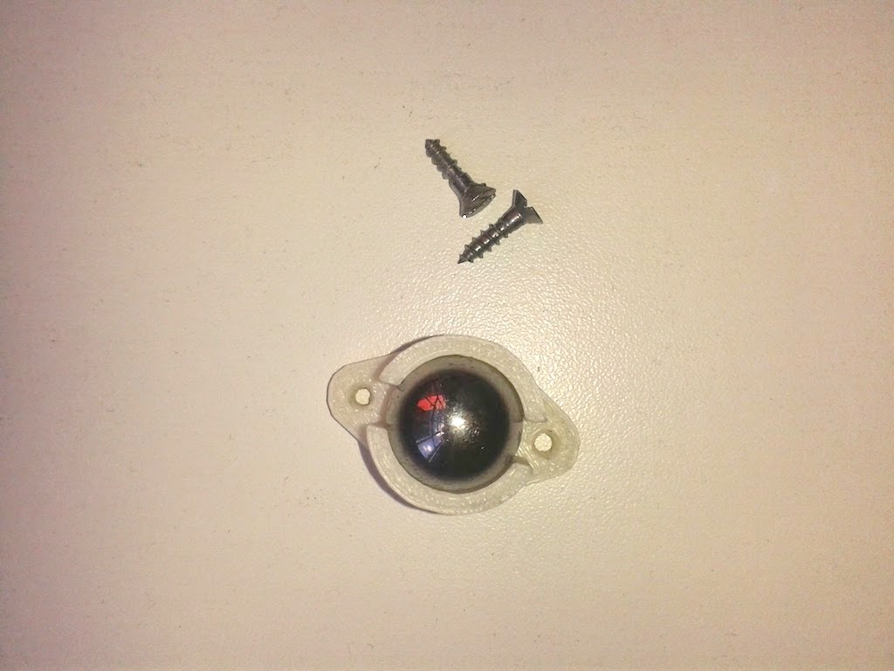
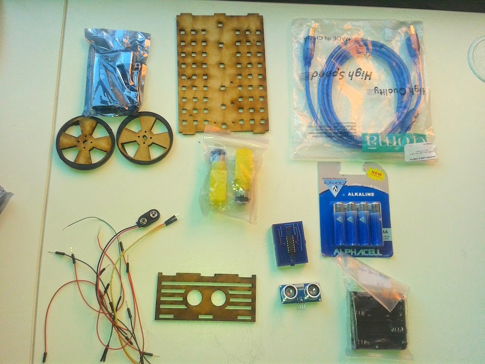
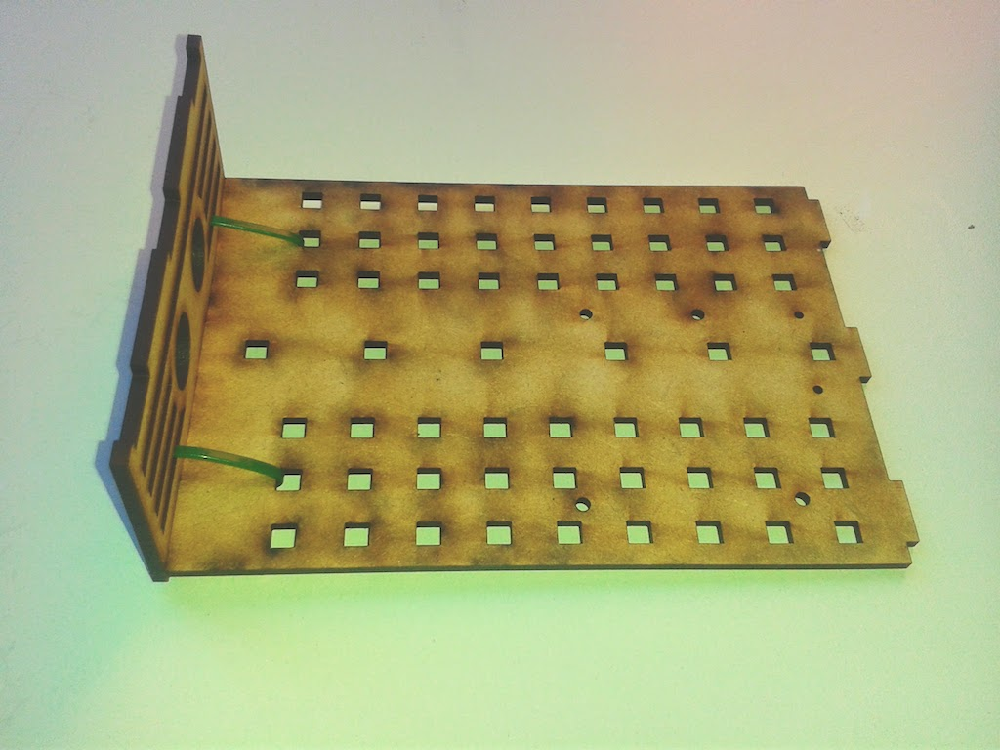
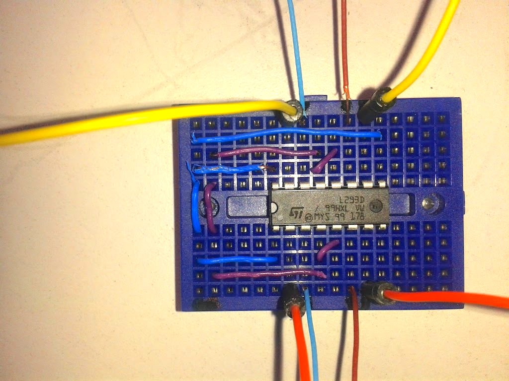

the big chassis plate should have a green dot pointing upwards

omniwheel

Take components out of the bag.

join the chassis

Put wheels on yellow motors.

how the attached wheels should look

sensor holes

### Distance sensor

* Insert the distance sensor into the two holes on the front side of the chassis with the pins facing up.
* Wire the ultrasonic sensor:
	* a small green y-shaped wire goes to the middle two pins .
	* there are two other wires that attach to the outer two pins

### Motor driver

The motor driver is installed on a breadboard to which you need to attach some wires

Attach the Orange and Yellow jumper wires onto the breadboard as in the photo.
	

Now attach the motor's cables to the breadboard just inside the  two wires added above

Now attach the battery packs positive wire (red) to the last pin of the IC – see the red wire on the right in the photo

Attach the ground (black wire) of the battery pack to the second row on the breadboard from the left – see black wire on    the photo

Now attach a black & red jumper wires – to be attached to the Arduino, red in the first row and black in the next row.  

Once the motor driver is wired up attach it with the battery pack to the chassis using tick tack or double sided tape.

